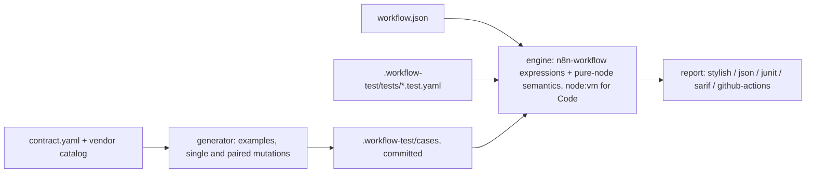

# workflow-test

> Generate and run contract tests from the payloads a workflow trigger can receive. n8n is the first supported platform.

[](https://github.com/LudwigGerdes/workflow-test/actions/workflows/ci.yml)
[](LICENSE)
[](#compatibility)


<details><summary>Text transcript</summary>

```
$ workflow-test run
workflows/signup.json
  ✗ no profile object, flat name — the ?? gotcha  1 expectation(s) fail
      ✗ node.Normalize.output[0].json.name: expected "Bob", got undefined
      ! "profile" is not produced here  at Normalize → assignments.assignments[1].value
      ! "plan" is not produced here  at Normalize → assignments.assignments[2].value
  ! no email at all  every expectation held
      ! "email" is not produced here  at Normalize → assignments.assignments[0].value
      ! "profile" is not produced here  at Normalize → assignments.assignments[1].value
      ! "plan" is not produced here  at Normalize → assignments.assignments[2].value
      ! "email" is not produced here  at Normalize → assignments.assignments[3].value
  ✓ pro user with nested profile

1 passed, 1 failed, 1 warned in 558ms
```
</details>

The workflow and test file behind that run are committed as
[`docs/demo/signup.json`](docs/demo/signup.json) and
[`docs/demo/signup.test.yaml`](docs/demo/signup.test.yaml).

## Why

An n8n workflow is only ever checked by running it, and its expressions are only ever checked against the one payload you clicked "Test" with. When a vendor sends a field as `null`, leaves an optional object out, or takes the other branch of a `oneOf`, n8n's evaluator swallows the resulting error and hands you `undefined` — the item quietly takes the wrong path and nothing turns red. workflow-test takes what the trigger can receive, derives the variants that could break the workflow, and runs every expression through n8n's own engine against each of them before the workflow is ever imported.

## Quickstart

Needs Node >= 24 (see [Compatibility](#compatibility) for why). It is one package on npm, with everything it needs inside it (the node descriptions, the vendor catalogues, the test-file schema):

```bash
npx workflow-test --help                 # run it without installing
npm install --save-dev workflow-test     # or pin it in the repo that holds your workflows
```

To work on the tool itself, build from a checkout (pnpm 10):

```bash
git clone https://github.com/LudwigGerdes/workflow-test && cd workflow-test
pnpm install && pnpm build
alias workflow-test="node $PWD/packages/cli/dist/bin.js"   # every example below assumes this
```

The package is a command line, not a library: it has no programmatic API and exports nothing to import.

Then, in the repository that holds your workflow JSON:

```
$ workflow-test init
created .workflow-test/tests/example.test.yaml
created .workflow-test/README.md

No n8n version recorded, so workflow-test uses the descriptions bundled inside it.
To match your instance: `workflow-test node-types --instance <url>`, then put
`n8nVersion: <version>` in .workflow-test/config.yaml.

Point it at a real workflow, then run `workflow-test run`.

$ workflow-test run
0 passed, 0 failed, 0 warned in 15ms
```

`init` scaffolds a fully commented example on purpose — a scaffold that fails its own first run only teaches you to ignore red lines. Point `workflow:` at a real file, uncomment, and run again; the hero above is what that looks like. For the full journey on a GitHub issue-triage workflow with a planted bug, read [`docs/walkthrough.md`](docs/walkthrough.md).

`pnpm install` warns that build scripts for `isolated-vm`, `esbuild`, `cpu-features` and `ssh2` were skipped. That is fine: they are transitive dependencies of `n8n-workflow`, and the sandbox uses `node:vm`.

Works fully offline. `gen`, `run` and `explain` never make a request; nothing is sent anywhere.

## What it does

- **As an n8n builder, I want** every expression checked against the payloads a vendor can actually send **so that** `$json.body.issue.assignee.login` on a nullable `assignee` fails on my machine, not in production → `contracts add`, `gen`, `run`
- **As an n8n builder, I want** to write a case by hand in a minute **so that** the one payload I know broke last week becomes a permanent test → `.workflow-test/tests/*.test.yaml`, `workflow-test schema`
- **As someone using an LLM to write tests, I want** an exact JSON Schema for the test file **so that** the model cannot guess at the format and unknown keys are rejected with a line number → `workflow-test schema`
- **As a team lead, I want** generated cases committed and checked in pre-commit and CI **so that** a pull request shows exactly which cases changed and stale ones block the merge → `gen --check`, `run --format sarif`, lefthook, GitHub Actions
- **As an n8n builder, I want** a run I already made turned into a test **so that** the suite tracks the workflow I actually drag boxes in, shape only, no values on disk → `capture`, `sync`
- **As an n8n builder, I want** a failing generated case as a paste-ready test file **so that** I can pin what *should* happen → `explain`, `promote`
- **As an n8n builder, I want** the tool to say plainly what it could not check **so that** a green run means what it says → boundaries, "needs a real execution"

## How it works



workflow-test reads the workflow JSON and walks it from the trigger, resolving every parameter with the published `n8n-workflow` package — the same evaluator and data proxy n8n uses — and applying its own semantics for the expression-pure node kinds (Set, IF, Switch, Filter, Merge, Code, Respond to Webhook and the rest — proven against real n8n execution exports, or, for Respond to Webhook, pinned to n8n's source: it hands its input on unchanged). Generated cases are mutations of a vendor's real example payload, focused on the paths the workflow's own expressions read, and are committed as content-hashed files. A node the engine cannot run — an HTTP call, a credentialed node, a Code node that reaches outside itself — ends that path as a **boundary**: everything up to it is verified, the rest is reported as needing a real execution. It never contacts the network during a run, never runs the workflow on an instance, and never changes your workflow file.

## Compatibility

| | Version |
|---|---|
| n8n tested against | 2.38.3 (the walkthrough ran against a real instance); expression engine is `n8n-workflow` 2.38.1 |
| Node-type descriptions bundled | n8n 2.10.0, 42 node types (`packages/engine/bundled/`); `node-types --version <v>` extracts any other release |
| Node | >= 24 (CI runs 24 and 26). `n8n-workflow` 2.38 depends, through `@n8n/expression-runtime`, on the native module `isolated-vm` 7, which supports Node 24 and newer only (prebuilt binaries for Node 24 and 26; it cannot build on Node 20). workflow-test never loads that module, but npm has to install it, so Node 24 is the floor. n8n 2.38 itself needs Node 24 when run from npm, so this matches the platform. |
| pnpm | 10 (`packageManager` pins 10.22.0) |

When the pinned `n8nVersion` in `.workflow-test/config.yaml` does not match the descriptions in use, the run says so and downgrades the one finding that depends on them — a missing required parameter — from failure to warning. Expressions, Code nodes and structural checks do not depend on the descriptions.

## Usage

From `workflow-test --help`:

| Command | What it does |
|---|---|
| `workflow-test contracts add <workflow.json> --vendor <v> --events <a,b> [--trigger <name>]` | Write a contract beside the workflow and materialise its shape files. Events are validated before anything is written; a later `--events` replaces the old. |
| `workflow-test contracts update [<workflow.json>...] [--all] [--fetch] [--vendor <v>]` | Re-materialise from the vendored catalogs. `--fetch` re-downloads the vendor spec first. |
| `workflow-test gen [<workflow.json>...] [--max N] [--check]` | Generate the variant cases for each contract into `.workflow-test/cases`. `--check` writes nothing and exits 1 when regeneration would change something. |
| `workflow-test run [<workflow.json>] [--only generated\|tests] [--format <f>] [--fail-on warn] [--concurrency N]` | Run every case through the tier-1 engine. Formats: stylish, json, junit, sarif, github-actions. |
| `workflow-test explain <caseId>` | Print a case as a test file, plus what the last run made of it. |
| `workflow-test schema` | Print the JSON Schema for a test file. |
| `workflow-test init [--n8n-version <v>] [--no-ask]` | Scaffold `.workflow-test` with a commented example test. |
| `workflow-test promote <caseId> [--name <file>]` | Copy a generated case into a hand-written test and keep it from being retired. |
| `workflow-test capture <workflow.json> --execution <file.json> \| --instance <url> [--workflow <id>] [--awaiting] [--update]` | Record what each node produced, as shape only, into the workflow's sidecar. |
| `workflow-test sync [--instance <url>] [--interval 30s] [--once]` | Compare every capture in the repo against the instance. |
| `workflow-test vendors list` / `workflow-test vendors audit` | Vendors, coverage, spec versions; the per-vendor audit. |
| `workflow-test node-types --version <v> \| --instance <url> \| --from <dir>` / `--list` | Extract the node descriptions for one n8n release; list what is available. |

`workflow-test <command> --help` prints one command's usage; `workflow-test --version` prints the version. Exit codes: `0` clean, `1` findings (or warnings with `--fail-on warn`), `2` usage or configuration error.

### run

Hand-written tests live in `.workflow-test/tests/*.test.yaml`. A payload is just the body; workflow-test wraps it in the envelope a Webhook node delivers, so `$json.body.…` resolves the way your expressions are written. Expectations are flat, dotted keys:

```yaml
workflow: ../../workflows/signup.json
cases:
  - id: flat-name
    title: no profile object, flat name — the ?? gotcha
    when:
      trigger: webhook
      payload:
        email: bob@example.com
        name: Bob
    then:
      execution.status: success
      node.Normalize.output[0].json.name: Bob
      node.Respond Free.items: 1
```

Generated and hand-written cases run through the same engine and appear in the same report; `--only tests` or `--only generated` narrows it. Each case gets one verdict: `✓` every expression resolved (or every expectation held), `✗` a failure, `!` a warning — an optional field that resolved to `undefined`, or a structural finding such as a read of a field the payload never carries, printed under the case — and `·` needs a real execution. Warnings never fail a run unless you ask with `--fail-on warn`.

**The gotcha this catches on the first run.** n8n's evaluator swallows expression errors and yields `undefined`:

```
{{ $json.body.profile.first_name ?? $json.body.name }}    ✗ still undefined
{{ $json.body.profile?.first_name ?? $json.body.name }}   ✓
```

When `profile` is missing, reading `.first_name` off it throws, and the whole expression — `??` included — is swallowed. The fallback never runs. Optional chaining avoids the throw, so `??` gets its turn. Nothing about the first form looks wrong, n8n reports no error, and the item quietly takes the wrong branch. That is the hero run above.

### contracts add, gen, run --only generated

A contract sits beside each workflow and names what its trigger receives. The event names are workflow-test's slugs (`issues-opened`, not GitHub's `issues`); a wrong one is rejected before anything is written, and the error lists what is available:


<details><summary>Text transcript</summary>

```
$ workflow-test contracts add workflows/signup.json --vendor github --events issues,pull_request
github has no materialised event "issues".
  available: check-run-completed, issue-comment-created, issues-opened, ping, pull-request-closed, pull-request-opened, push, release-published, star-created, workflow-run-completed
  it is not among the 270 events github publishes.

$ ls workflows
signup.json

$ workflow-test contracts add workflows/signup.json --vendor github --events issues-opened,pull-request-opened
workflows/signup.contract.yaml
  vendor  github @ 1.1.4
  events  issues-opened, pull-request-opened
  shape   ../.workflow-test/contracts/github.multi-c1e28918.schema.json
```
</details>

The contract it writes:

```yaml
version: 1
trigger: Webhook
source:
  kind: vendor
  vendor: github
  events:
    - issues-opened
shape:
  schema: ../.workflow-test/contracts/github.issues-opened.schema.json
  examples: ../.workflow-test/contracts/github.issues-opened.examples.json

# The only hand-edited section: paths to keep, prune, or restrict to.
# overrides:
#   required: []
#   never: []
#   only: []
```

`source` is resolved once into committed files pinned to a spec version, so every later run reproduces exactly. Paths in `overrides` are dotted, with `[]` for every element and `[n]` for one (a path containing brackets needs quoting in a YAML flow sequence).

`gen` turns the contract into the cases worth running and writes them under `.workflow-test/cases/`:

```
$ workflow-test gen
workflows/issue-triage.json → github.issues-opened: 14 case(s) — 14 added, 0 retired, 0 unchanged (budget 14 for 4 nodes, 486 discarded)

$ workflow-test gen --check
workflows/issue-triage.json → github.issues-opened: 14 case(s) unchanged
```

Case ids are content hashes, so an unchanged contract and workflow always produce byte-identical files, and `--check` is the pre-commit shape. Running them on the walkthrough's issue-triage workflow, whose Set reads `issue.assignee.login` off a nullable `assignee`:


<details><summary>Text transcript</summary>

```
$ workflow-test run --only generated
workflows/issue-triage.json
  ✗ nullable-null body.issue.assignee  assignment "assignee" resolved to undefined
      at Build Triage Record → assignments.assignee
      ✗ read field "login" on a null  at Build Triage Record → assignments.assignments[2].value
  ✓ format-edge body.issue.title (empty)
  ✓ format-edge body.issue.title (unicode)
  ✗ nullable-null body.issue.assignee + nullable-null body.issue.user  assignment "reporter" resolved to undefined
      at Build Triage Record → assignments.reporter
      ✗ read field "login" on a null  at Build Triage Record → assignments.assignments[1].value
      ✗ read field "login" on a null  at Build Triage Record → assignments.assignments[2].value
  ! optional-absent body.issue.assignee  assignment "assignee" resolved to undefined
      at Build Triage Record → assignments.assignee
      ! "assignee" is not produced here  at Build Triage Record → assignments.assignments[2].value
  ✓ format-edge body.issue.assignee.login (empty) + format-edge body.issue.title (empty)
  ✓ format-edge body.issue.assignee.login (unicode)
  ✓ format-edge body.repository.full_name (unicode)
  ✓ format-edge body.issue.assignee.login (empty)
  ✓ format-edge body.issue.user.login (empty)
  ✓ format-edge body.repository.full_name (empty)
  ✓ example #0 (issues-opened)
  ✗ nullable-null body.issue.user  assignment "reporter" resolved to undefined
      at Build Triage Record → assignments.reporter
      ✗ read field "login" on a null  at Build Triage Record → assignments.assignments[1].value
  ✓ format-edge body.issue.user.login (unicode)

10 passed, 3 failed, 1 warned in 1069ms

note: n8n 2.38.3 is not bundled; using the nearest older 2.10.0
      `workflow-test node-types --version <yours>` to match your instance
```
</details>

The planted bug (`assignee` is nullable) is found, and so is one that was not planted: `issue.user` is nullable too, which nobody would think to check.

**What gets generated.** Every vendor example is kept verbatim as the realism anchor. Around it, six kinds of variant are generated as mutations of a real example rather than built from the schema: `optional-absent`, `nullable-null`, `oneOf-branch`, `enum-value`, `array-cardinality`, `format-edge` (empty and unicode strings, epoch dates, 0, −1, MAX_SAFE_INTEGER). A `oneOf` branch no example covers is synthesised from its required fields and tagged `synthesized`. Variation happens only where the workflow actually reads — paths extracted from its own expressions, traced through Set lineage — then single mutations, then every pair on independent paths. The budget is about 3.5 cases per node; every single mutation on a read path always survives it, pairs compete for the rest, and `--max N` overrides it. `overrides` in the contract steer it: `required` stops a path being dropped, `never` prunes a subtree, `only` restricts events.

**Vendors.** Two vendors ship webhook catalogues today, both with machine-readable schemas: **GitHub** (10 curated events of 270 published, spec 1.1.4) and **Stripe** (7 of 265). Slack publishes no schema for Events API payloads and is listed with nothing:

```
$ workflow-test vendors list
vendor    coverage       spec version          events
github    schema         1.1.4                 10 of 270
stripe    schema         2026-08-26.dahlia     7 of 265
slack     nothing        —                     —
```

To add an event or a vendor: add it to `packages/vendors/sources.yaml`, run `pnpm ingest` in `packages/vendors` (the one place that downloads a spec), commit the catalog under `packages/vendors/data/`, and update [`packages/vendors/AUDIT.md`](packages/vendors/AUDIT.md). Raw spec bytes go to `~/.workflow-test/vendor-specs/` (`WORKFLOW_TEST_CACHE` moves it), never into the repo. For a custom webhook with no vendor, hand-written tests are the route today (see Known issues).

### explain and promote

`explain <caseId>` prints a failing case as a complete, paste-ready test file — the payload that produced it included — plus the last run's verdict:

```
$ workflow-test explain 11df5e3da2dee888
# ../../../../workflows/issue-triage.json
workflow: ../../../../workflows/issue-triage.json
cases:
  - id: 11df5e3da2dee888
    title: nullable-null body.issue.assignee
    when:
      trigger: webhook
      payload:
        headers:
          content-type: application/json
          accept: "*/*"
          x-github-event: issues
...
# last run: status fail — assignment "assignee" resolved to undefined
#   at Build Triage Record → assignments.assignee
```

`promote <caseId> --name missing-assignee` copies a generated case into `.workflow-test/tests/` with a `then:` block to fill in and records the id so regeneration stops retiring it.

### capture and sync

Hand-writing cases for a workflow you built by dragging boxes is a task nobody does twice, so the suite goes stale. `capture` turns a run you already made into the test:

```bash
workflow-test capture workflows/invoice.json --execution export.json
workflow-test capture workflows/invoice.json --instance https://n8n.example   # newest execution, needs N8N_API_KEY
```

It records **shape only** — which fields exist and what type each holds. No values reach disk, so a capture is safe to commit, and shape is what survives promotion between dev and production anyway. It lands in `workflows/invoice.contract.yaml`, beside the workflow, so it travels with it. Capturing again reports what moved and never replaces the record without `--update`:

```
invoice.json: 1 node(s) changed shape
  Format Customer
    removed  customer.tier  string is no longer produced
  re-run with --update to accept
```

A field that stopped being produced is the dangerous one: whatever reads it downstream now resolves to undefined. A rename is followed by node id. `--awaiting` records a workflow that is active but has not run yet, rather than an empty capture that would read as "produced nothing".

A capture is also what gets a run past a boundary: given one, the walk substitutes that node's recorded shape and carries on, so a single HTTP call costs you that node rather than everything after it. The report says `stood in for 1 node from a recorded capture` so a green run never silently rests on stand-ins.

`sync` compares every capture in the repo against the instance: `--once` for one pass (exits 1 when a capture is behind, which makes it a CI check), `--interval 2m` to keep watching. With `WORKFLOW_TEST_MODE=dev` a newer execution is recorded instead of reported. That variable exists for `capture` and `sync` only — it decides whether drift is accepted, never what counts as a pass, and `run` is identical in both. It is an environment variable rather than a file on purpose: the same checkout is dev on your machine and test in CI.

Both instance commands read the API key from `N8N_API_KEY` only; the url comes from `N8N_API_URL` or `--instance`. The key is never accepted as an argument, because an argument ends up in shell history.

### node-types

workflow-test reads n8n's node descriptions to know which parameters are required and when they apply. A trimmed set for n8n 2.10.0 ships inside the package, so a fresh install works offline. To match your instance:

```bash
workflow-test node-types --version 2.38.3                    # from the npm registry, once
workflow-test node-types --instance https://n8n.example.com  # asks the instance which version it runs (no credential)
workflow-test node-types --from ./my-custom-nodes            # custom nodes, offline
workflow-test init --n8n-version 2.38.3                      # or put n8nVersion: 2.38.3 in .workflow-test/config.yaml
```

```
$ workflow-test node-types --list
pinned version: 2.38.3 (.workflow-test/config.yaml)

bundled:   2.10.0 (inside workflow-test, always available)
extracted: none — `workflow-test node-types --version <v>` to add one

a run would use: bundled 2.10.0 — not an exact match for 2.38.3
  a missing required parameter is reported as a warning, not a failure
```

Extracted sets live in `~/.workflow-test/node-types/` (`WORKFLOW_TEST_CACHE` moves it). `n8nVersion` lives in git because it describes the workflows in the repository, the same for everyone who clones it.

## Layout

```
workflows/invoice-sync.json
workflows/invoice-sync.contract.yaml     source + overrides, and any capture
.workflow-test/contracts/    materialised schema + examples (committed)
.workflow-test/cases/        generated cases, one JSON per case plus index.json (committed)
.workflow-test/tests/        hand-written and LLM-written tests (committed)
.workflow-test/reports/      the last run (gitignored)
.workflow-test/config.yaml   n8nVersion
```

## Editor, CI and AI integration

**Pre-commit (lefthook).** [`lefthook.yml`](lefthook.yml) and [`scripts/workflow-test.sh`](scripts/workflow-test.sh) are in this repo. Copy the script into the repo holding your workflows, point `WORKFLOW_TEST_HOME` at this built checkout, and `npx lefthook install`. (With the npm package installed in that repo, the two hook commands are simply `npx workflow-test gen --check` and `npx workflow-test run`.) Every commit then runs `gen --check` and `run`; without the checkout the hook prints one line and exits 0. Details in [`docs/ci.md`](docs/ci.md).

**GitHub Actions.** [`.github/workflows/ci.yml`](.github/workflows/ci.yml) is a working recipe: after `pnpm build`, `node packages/cli/dist/bin.js gen --check` then `run --format sarif > workflow-test.sarif`, uploaded as an artifact. SARIF regions are file-level because workflow-test does not read the workflow file's text; `--format github-actions` prints `::error file=…` annotations directly.

**LLMs.** Hand `workflow-test schema` to a model and let it write cases: the schema is exact (draft 2020-12, with descriptions), unknown keys are rejected with a JSON pointer and line number, and a payload is just the body. There is no MCP server.

## Why not …?

| Alternative | What it gives you | Use that instead when… |
|---|---|---|
| Clicking "Test workflow" in n8n | One execution against one payload, with the real nodes | you need the HTTP calls and credentials to actually run — workflow-test stops there and says so |
| n8n's own expression validation | Syntax errors in the editor | the expression is malformed; workflow-test is about well-formed expressions that resolve to `undefined` on a payload you never tried |
| A mock server for the webhook ([integration-mock](https://github.com/LudwigGerdes/integration-mock)) | Replays real requests into a running instance | you want the whole workflow executed end to end; workflow-test needs no instance and runs in under a second |
| Reviewing the JSON by hand | Judgement | the question is design, not data shape; workflow-test only knows what a vendor can send |

## FAQ

**Does it change my workflow?** No. It reads the JSON and writes only under `.workflow-test/` and the `<workflow>.contract.yaml` sidecar.

**Does it need my n8n instance?** No. `run`, `gen` and `explain` are offline. Only `capture --instance`, `sync`, `node-types --version|--instance` and `contracts update --fetch` reach the network, each behind its own flag.

**Why does a case say "needs a real execution"?** The walk reached a node it cannot run — an HTTP Request, a credentialed node, a Code node calling `$helpers.httpRequest` — and stopped there. Everything before it is verified; assertions past it, and any `calls` / `noUnmatched` expectation, are neither passed nor failed. A recorded capture lets the walk continue past that node.

**Do Code nodes run?** Yes, in a `node:vm` sandbox with the same data proxy n8n gives them, right up until they reach outside themselves. What a Code node does to the data is observed once, on the vendor's example, and committed beside the cases; editing the node makes `gen --check` fail.

**Why `0 passed` with warnings?** A `!` case held every expectation but an optional read resolved to `undefined`, or the payload never carries a field an expression reads. The reason is printed under the case. `--fail-on warn` turns those into failures.

**Which n8n version?** Expressions are evaluated by `n8n-workflow` 2.38.1; node descriptions bundled are 2.10.0 and can be extracted for any release. Pin yours in `.workflow-test/config.yaml`.

## Known issues

- **Custom (non-vendor) webhooks have no contract path.** `contracts add` requires `--vendor`, and only GitHub and Stripe ship catalogues. For your own payload shape, write cases by hand in `.workflow-test/tests/`; a `source.kind` for a local schema or example is not built.
- **Event names are workflow-test's slugs**, and `vendors list` prints counts, not names. The `contracts add` error lists them; there is no `vendors events <vendor>` yet.
- **Respond to Webhook in `jwt` or `binary` mode is still a boundary** (one signs with a credential, the other needs binary data the engine does not carry). Every other mode runs through.
- **Generated case titles for an unlabelled `oneOf` branch carry a double space** (`oneOf-branch  (branch 0)`). Cosmetic.
- **Pairs are sampled, not exhaustive.** Pairs of nulls on read paths are bought first; a workflow that breaks only when three fields coincide will not be caught.
- **Guards written as `a !== null ? … : …` or inside an enclosing `if` are not recognised** as handling a missing value and are still reported (`a?.x`, `a && a.x`, `a ? a.x : b` are).
- **One hostile expression can still take a run down.** A worker's memory ceiling contains runaway growth, but a single oversized allocation makes V8 abort the process.
- **`gen` on a workflow with no contract** prints an odd blank label before the colon and does not suggest `contracts add`.

## Status

Usable today: contracts for GitHub and Stripe, generation with `--check`, hand-written tests with an exact schema, `run` with five reporters, `explain`, `promote`, `capture`, `sync`, `node-types`. The engine interprets fifteen node kinds and treats everything else as a boundary. Out of scope by design: executing a workflow on an instance, HTTP calls, credentials. One self-contained npm package from 0.1.0; every release is gated on an install-level smoke test (`pnpm smoke`) that installs the packed tarball into an empty project and runs this README's quickstart.

## Support and maintenance

workflow-test is maintained by one person alongside other work. Bugs go to GitHub Issues (use the template and include your n8n version and a minimal workflow JSON). Questions go to Discussions. Expect a first response within about a week; nudge the thread if you hear nothing. Feature requests are welcome but not promised.

## Contributing

See [CONTRIBUTING.md](CONTRIBUTING.md). The loop is `pnpm install && pnpm verify` (build, then typecheck, then test — build leads because packages expose their types from `dist`); tests come first, and a new node semantics is pinned to n8n's own behaviour by a test.

## Related tools

Four standalone tools for workflow JSON, built by one maintainer. Each works on its own; together they cover the loop from lint to mock to test to render. n8n is the first supported platform.

| Tool | What it does |
|---|---|
| [workflow-lint](https://github.com/LudwigGerdes/workflow-lint) | Lint and format workflow JSON; pre-commit hook, GitHub Action, MCP server |
| [integration-mock](https://github.com/LudwigGerdes/integration-mock) | Mock the APIs a workflow's integrations call; snapshot real runs and replay them |
| [workflow-test](https://github.com/LudwigGerdes/workflow-test) | Generate and run contract tests from the payloads a trigger can receive |
| [workflow-render](https://github.com/LudwigGerdes/workflow-render) | Render workflow and execution JSON to SVG/PNG offline; embed and export |

Not affiliated with n8n GmbH.

## License

MIT © Ludwig Gerdes. See THIRD_PARTY_NOTICES.md for bundled n8n-derived data and other third-party material. Not affiliated with n8n GmbH.
